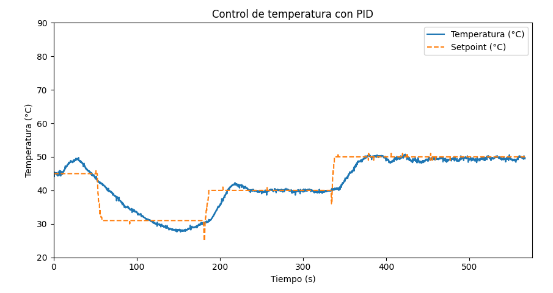
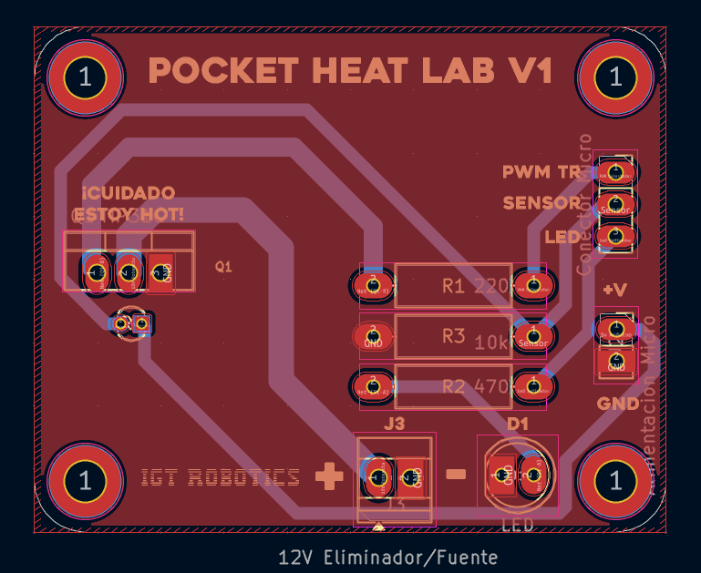

# Pocket Heat Lab

## 📌 Overview
**Pocket Heat Lab** is a compact thermal control laboratory designed to demonstrate and experiment with **digital PID control** on a real physical system.

The project uses an **ESP32** to regulate the temperature of a **BJT transistor used as a thermal plant**, leveraging PWM control, real-time sensing with a thermistor, and external visualization tools for tuning and analysis.

This project was developed with an educational focus, bridging **control theory**, **embedded systems**, and **practical electronics**.

---

## 🔥 System Concept
A BJT transistor, when biased appropriately, dissipates power and generates heat.  
This behavior is exploited as a **slow, inertial thermal plant**, ideal for demonstrating PID control principles.

The ESP32:
- Reads temperature from a 10 kΩ NTC thermistor
- Computes a digital PID controller
- Drives the transistor using a **limited PWM signal**
- Streams data over serial for monitoring and tuning

---

## 🎯 Objectives
- Implement a **digital PID controller** on an ESP32
- Regulate the temperature of a real thermal system
- Explore tuning effects on stability and response
- Provide real-time visualization and interaction
- Maintain safe operating limits for the power device

---

## 🧩 Hardware Overview
- **Microcontroller:** ESP32
- **Thermal plant:** BJT transistor (power dissipation)
- **Temperature sensor:** 10 kΩ NTC thermistor
- **Thermal coupling:** Thermistor mounted with thermal paste
- **PCB:** Custom-designed board

Thermal contact between the sensor and the transistor is critical for accurate control:

---

## ⚡ Safety & Design Constraints
To prevent damage and unsafe operation:
- PWM output to the transistor is **limited to 28 / 255**
- Maximum power dissipation kept below ~2 W
- Sampling and control period set to **100 ms**
- Anti-windup implemented in the integral term

These constraints ensure stable behavior even under poor tuning conditions.

---

## 🧠 Control Algorithm
- **Controller type:** Digital PID
- **Sampling period:** 100 ms
- **Setpoint selection:** Potentiometer (25 °C – 80 °C)
- **Anti-windup:** Integral clamping
- **Output saturation:** PWM constrained

Final stable gains obtained experimentally:
- `Kp = 4`
- `Ki = 0.15`
- `Kd = 2.1`

---

## 📈 Visualization & Tuning
To facilitate tuning and understanding of system behavior, a **Python-based GUI** was implemented using:
- `Tkinter`
- `Matplotlib`
- `PySerial`

Features:
- Real-time plotting of temperature and setpoint
- Live adjustment of PID gains via sliders
- Serial data logging to CSV for offline analysis

---

## 📊 Results
The system demonstrates:
- Stable temperature regulation
- Clear response to setpoint changes
- Expected thermal inertia behavior
- Sensitivity to PID tuning (trial-and-error process)

Example plots of recorded data:

  

---

## 🖥 PCB Design
The project includes a custom PCB designed specifically for this laboratory setup.

- Rendered PCB view:
  
  

- PCB layout:
  
  

---

## 🎥 Demo
The following GIF shows the system operating in real time, including temperature response and control action:

---

## 📁 Repository Structure
    pocket-heat-lab/
    ├── firmware/ # ESP32 PID controller code
    ├── software/ # Python visualization and tuning tools
    ├── hardware/ # PCB files
    ├── images/ # Documentation images and GIFs
    ├── docs/
    │ └── CONTROL_TEMPERATURA.pdf
    └── README.md

    
---

## 📄 Technical Report
A full academic report describing the system, methodology, and results is available here:

📄 `docs/CONTROL_TEMPERATURA.pdf`

This document includes:
- Theoretical background
- Detailed implementation
- Experimental results
- Conclusions and discussion

---

## 🚀 Project Status
✅ Implemented and tested  
✅ Real-time visualization working  
🔧 Open to future improvements (filtering, better sensing, power stage refinement)

---

## 🔮 Possible Improvements
- Signal filtering for temperature measurements
- Dedicated power stage (MOSFET instead of BJT)
- Higher-resolution PWM
- Model-based tuning methods
- Closed-loop current monitoring

---

## 📜 License
To be defined.
